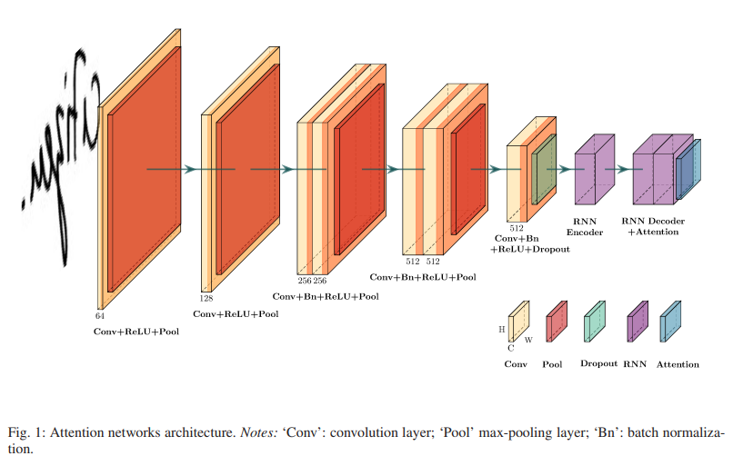
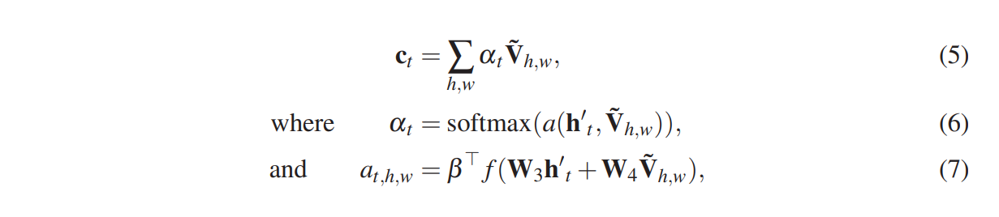
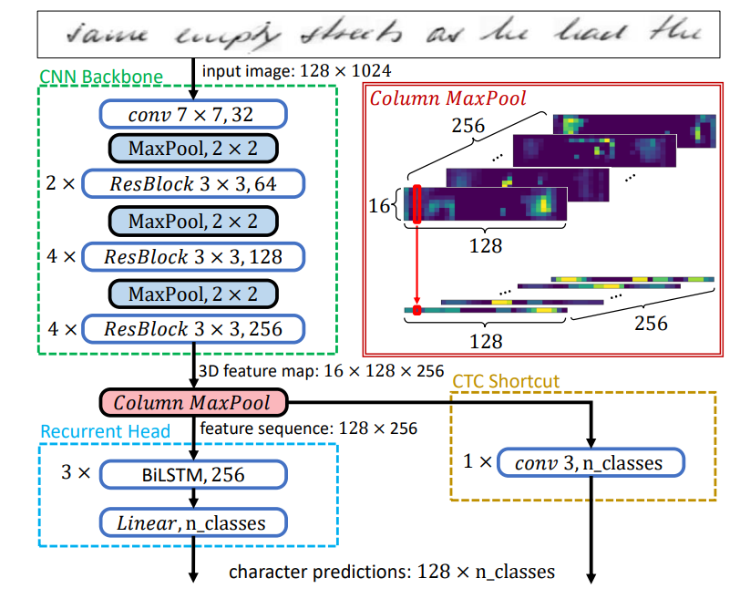
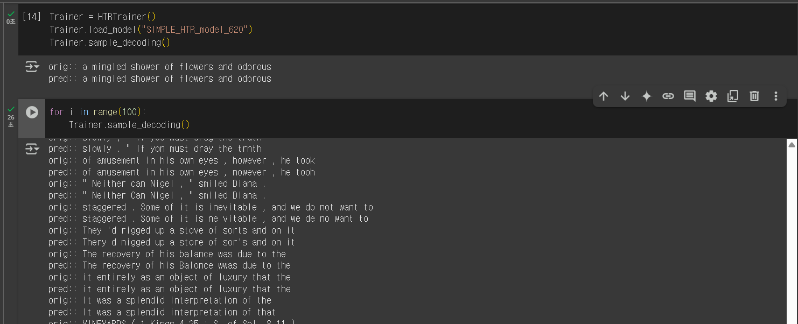
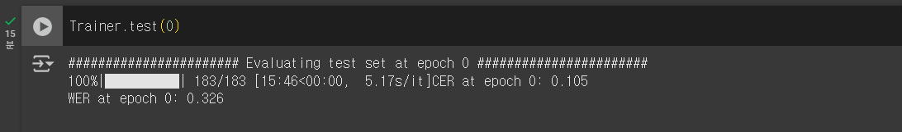

# Portfolio

#### Technical Skills: C++, Python, Pytorch, Node.js, Express, Java

## Career
 - AI engineer 로 성장하고자 하는 신입 개발자입니다.
 - 시간이 적절히 주어진다면, 원하는 layer, Model 을 pytorch 를 이용해 만들 수 있습니다.
 - 논문 내용을 구현, 모델링 해봤습니다.
 - tensorflow to pytorch code script 를 경험했습니다.
 - Encoder-Decoder model 구축해봤습니다.
 - C++ 의 기본적인 개념들(Concurrency, Multi Thread, OOP)을 알고 있습니다.

## Education
- M.S., Mathmatics | Yonsei University 2019.09 - 2021.08	 			        		
- B.S., Mathmatics | Incheon University 2014.03 - 2019.08

### Course 
- 정보시스템 구축 보안엔지니어 양성 B (메가스터디아이티(IT)아카데미학원) 2021.07 - 2021.09 
- 씹어먹는 C++ (modoocode.com) 2021.09 - 2021.11
- [풀스택] 유튜브 클론코딩 (nomadcoders.co) 2024.08 - 2024.10
- Udemy Modern C++ Concurrency in Depth ( C++17/20) 2025.02 - Now

## Certificates
- CCNA (Cisco Systems) 2021.11
- RHCSA (Redhat) 2022.07

## Projects 

### Character-Based Handwritten Text Transcription with Attention Networks
#### non-official implement!
- period 2025.04 - 2025.04
- [colab script](https://github.com/cirbee/cirbee.gihub.io/blob/10fcb837646c1eaab4f6a27e66440976fe9b4cd8/src/Character-Based%20Handwritten_version2.ipynb)

#### 부가설명
 혼자해낸 OCR 논문 구현 Project 입니다. 가독성을 위해 colab을 이용했습니다. 개인적으로 Encoder-Decoder model 에 대한 공부를 목표하고, 해당 논문을 구현하기로 결정했습니다.

 최대한 논문 내용 구현의 충실히 했으며, 구체적인 파라미터 값이 나타나지 않은 경우 References [Code](https://github.com/jvpoulos/Attention-OCR) 를 참고했습니다. 본 논문은 attention based Encoder-Decoder model을 포함하고 있습니다. 다른 주제의 attention Encoder-Decoder model 과 달리 image to string model 이라는 점이 독특합니다. CNN layers 에서 추출한 features 값을 Attention layer 의 weighted Query 값으로 해석하고 이용하는 특징점이 있습니다. 

 참고한 [Code](https://github.com/jvpoulos/Attention-OCR)에서 tensorflow 기반으로 buckets 을 활용한 batch 단위에 마다 processing 을 다르게 적용하면서 학습하였지만, 학습 데이터를 Iam Data 만을 이용해 해당 부분을 사용할 이유가 없다고 판단하여, 이를 빼고 구현했습니다. 기존에 pytorch를 이용해 구현해왔기 때문에, tensorflow로 작성된 부분을 pytorch 로 바꾸어 작업 했습니다. 

 학습에 시간이 오래걸려, 구글에서 지원하는 자원량을 초과해 추후에 마저 결과값을 첨부하겠습니다. 

##### 사용한 library
path, numpy, PIL, pytorch, editdistance

##### 구현 내용 or 한 것들
- path : huggingface, data save & load, char_set 
- prepocessing : image resize, image padding, label padding, RandomAffine
- Architecture : attention based encoder-decoder model
- CER : editdistance [Code](https://github.com/georgeretsi/HTR-best-practices/) 참고했습니다.
- decoder : [Code](https://github.com/georgeretsi/HTR-best-practices/) 참고했습니다.

References
- [Paper : attention-networks-for-image-to-text](https://paperswithcode.com/paper/attention-networks-for-image-to-text)
- [Code](https://github.com/jvpoulos/Attention-OCR)

loaded on [github](https://github.com/cirbee/SIMPLE) 

### Best Practices for a Handwritten Text Recognition System
#### non-official implement!
- period 2024.06 - 2024.09
- rebuild 2025.04
- [colab script](https://github.com/cirbee/cirbee.gihub.io/blob/10fcb837646c1eaab4f6a27e66440976fe9b4cd8/src/SIMPLE_HTR_colab_version.ipynb)

Evaluations

#### 부가설명
 혼자해낸 OCR 논문 구현 Project 입니다. 가독성을 위해 colab을 이용했습니다. AI 관련 학습능력의 검증, 증명을 위해 해당 프로젝트를 진행했습니다. 

OCR 분야 내 Multidimensional RNN 모델의 적용 필요성을 건의하면서, ResBLock 을 활용한 경량화 된 Architecture 를 제안한 논문을 참고했습니다. CNN-ResBlock layer를 통한 features 추출 후, 문자의 읽는 순서를 고려한 Column wise Max pooling 을 거쳐, LSTM layer 를 이용한 character 를 분류 모델입니다. train set에 대해, CTC-short layer 값을 거쳐 해당 결과를 오류 값 계산에 추가적으로 이용한다는 것이 독특한 부분입니다. (해당 layer 결과값의 경우 0.1 만큼 보정된 값으로 계산합니다.) 

2025.04, 파일 단위로 구성된 프로젝트를 colab 으로 다시 구성해 작성했습니다.  

##### 사용한 library
path, numpy, PIL, pytorch, editdistance

##### 구현 내용 or 한 것들
- path : huggingface, data save & load, char_set 
- prepocessing : image resize, image padding, label padding, RandomAffine 
- Architecture : attention based encoder-decoder model
- CER, WER : editdistance [Code](https://github.com/georgeretsi/HTR-best-practices/) 참고했습니다.
- decoder : [Code](https://github.com/georgeretsi/HTR-best-practices/) 참고했습니다.
- Trainer : schedular multiStep 

References
- [Paper : best-practices-for-a-handwritten-text](https://paperswithcode.com/paper/best-practices-for-a-handwritten-text)
- [Paper : Are Multidimensional Recurrent Layers Really Necessary for Handwritten Text Recognition?](https://ieeexplore.ieee.org/document/8269951)
- [Code](https://github.com/georgeretsi/HTR-best-practices/)

loaded on [github](https://github.com/cirbee/SIMPLE)

### Seminar
- FHE School 2025.01 - 2025.02
- 서울대 암호학 연구실, 크립토랩 CKKS 모듈 연구 
- [CKKS paper](https://eprint.iacr.org/2016/421.pdf)
- [PIR paper](https://eprint.iacr.org/2017/1142)

FHE 암호 모듈에 대한 기본적인 사항들을 배우고, 이를 바탕으로 연구주제를 정하여 기능 구현을 목표로한 세미나 입니다. 서울대 암호학 연구실에서 개발한 CKKS 모듈을 중점적으로 배우고, FHE 구현을 위한 기능들을 학습했습니다. 이를 바탕으로 FHE 연구주제를 정해, CKKS 기반한 기능 구현, 테스트 하였습니다. 

##### FHE(Fully Homeomorphic Encryption) 
데이터들을 암호화한 상태에서 연산 가능한 암호모듈을 통칭합니다. 완전히 신뢰하지 못하는 server(cloud data server ...)에 데이터를 저장하고 참조할 때 데이터 유출없이 사용가능하게 하는 암호무듈 기술를 의미합니다. 기본적인 사칙연산과 relu function, regression 등을 지원하여, AI, deep learning 학습에 암호화된 데이터를 사용 가능합니다.  

기본 기능 : KeySwitch, Rescaling, Bootstrap, FFT(Fast Fourier Transform), DTT(Discrete Fourier Transform), NTT(Number Theoretic Transform)

바탕 지식: number theory, abstract algebra, cyclotomic field, homeomorphic

##### 세부연구
PIR(Private information retrieval) 연구주제로 잡았습니다. client 가 server에 어떤한 정보를 참조, 요청하는 것을 숨기는 기능을 의미합니다. 기존 CKKS 모듈의 경우 PIR 기능이 없었지만, 세부연구를 진행하면서 CKKS 모듈에 적용가능한 PIR 기본 기술(query compression)을 구현했습니다. 

##### 구현 내용 or 한 것들 (CKKS library )
- C++ 라이브러리, cmake 이용 
- PIR : Query Compression( Query expanding ) 
